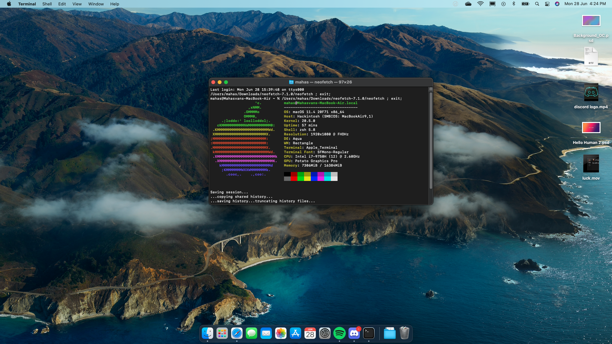
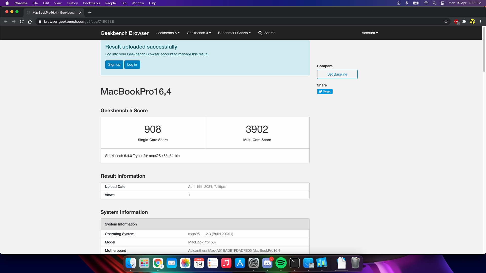
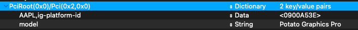
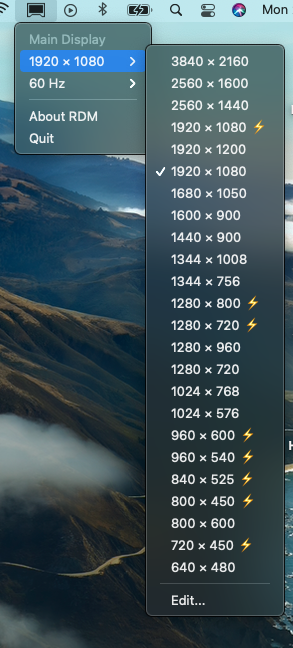

# Inspiron-759x-Hackintosh
This repository is for people who want macOS on their Inspiron 759x laptops.

## Current OpenCore version on this EFI: 0.9.5

## Specs:
| Part         | Name                                  |
|--------------|---------------------------------------|
| CPU          | Intel Core i7 9750H                   |
| RAM          | 16GB DDR4 2666Mhz                     |
| Graphics     | GTX 1050 (disabled via SSDT) + UHD630 |
| Connectivity | Intel AC9560 Wifi+BT                  |

## What works
- Graphics Acceleration
- Wi-fi and Bluetooth
- Fan Control
- CPU Power Management
- USB Ports (may need remapping depending on device)
- Sleep
- Camera
- Battery Reading
- Brightness Control
- SD Card Reader
- Audio Output

## What doesn't work
- Fingerprint
- HDMI (not tested, though it will probably work with the right patches)
- Thunderbolt (not tested)
- Hibernate (not tested)
- Internal mic (will never work)

## Note: The files in the source code are ONLY FOR REFERENCE
Modify the required fields in the `config.plist` before using this in your machine. (Or better, just don't use my EFI. Just make your own tbh)

Follow Dortania's [Opencore Install Guide](https://dortania.github.io/OpenCore-Install-Guide/) to make your EFI. (Highly recommended)

With that said, my EFI folder is uploaded anyway.

## What to change

### Config entries

- DeviceProperties
    - Add
        - PciRoot(0x0)/Pci(0x1F,0x3)
            - layout-id
        - PciRoot(0x0)/Pci(0x2,0x0)
            - Framebuffer patches if needed (explained in the Dortania guide)

- Misc
    - Debug
        - AppleDebug
        - ApplePanic
        - Target

- NVRAM
    - Add
        - 7C436110-AB2A-4BBB-A880-FE41995C9F82
            - boot-args

- PlatformInfo
    - Generic
        - MLB
        - ROM
        - SystemSerialNumber
        - SystemUUID

### Misc changes
- You might need to remove TscAdjustReset.kext depending on whether you're running Monterey or not. You don't need TscAdjustReset unless running Monterey.
- In the `info.plist` of TscAdjustReset.kext, change the `IOCpuNumber` to the number of CPU thread you have minus 1. For example, I have entered `11` since I have 12 threads in my CPU.
- Probably will need to redo the USB Mapping (instructions in the Dortania's OpenCore Post Install Guide)

This is just a rough overview, is not necessarily complete, and I am absolutely not responsible for anything that may happen to your machine or your sanity.

### Kexts

The kexts mentioned in the dortania guide are all that are needed to boot. However, there are some kexts that offer extra features. These are recommended for post-install.

#### Note: You may need CpuTscSync if your booting process gets stuck. (I need it, so I included it in the kexts folder)

CPUFriend: Facilitates proper Power management for the CPU. Needs another kext `CPUFriendDataProvider`, which we can make ourselves by following the post install guide. I have included this kext which was made for my machine, according to my requirements.

NoTouchID.kext: Fingerprint sensors in Hackintoshes have no way of working in macOS. So we use this kext. (Apprently is not needed in Big Sur 11.3+, but I haven't tried to confirm this)

BrightnessKeys.kext: Facilitates automatic handling of brightness keys without acpi modification.

VirtualSMC Plugins:
 - SMCProcessor
 - SMCSuperIO
 - SMCDellSensors
 - SMCBatteryManager

VoodooI2C + VoodooI2cHID: Needed for proper trackpad functioning. 

### Benchmarks

### Troubleshooting

Even though you followed the Dortania guide correctly, there are bound to be errors. There's the Hackintosh community, where you can discuss and solve problems.
r/Hackintosh discord server: https://discord.gg/u8V7N5C
r/Hackintosh Subreddit: https://www.reddit.com/r/hackintosh/

### Bonus

#### Renaming the Integrated Graphics in macOS
You can rename your integrated graphics card by making an entry called `model` inside `PciRoot(0x0)/Pci(0x2,0x0)` in your config.plist

#### Getting a visually more polished UI by faking a 1080p display as 1080p HiDPI

Download [RDM](https://github.com/usr-sse2/RDM) and follow the instructions below

Click on `Edit` in the bottom of the resolution selector pane

Enter your resolution, and check the boxes for `Retina` and `HiDPI`

Choose the preview icon you want, I chose a MacBook Air's image. After rebooting, your 1080p HiDPI resolution should be visible in the RDM resolution pane.

Add RDM to your login items, and enjoy!
